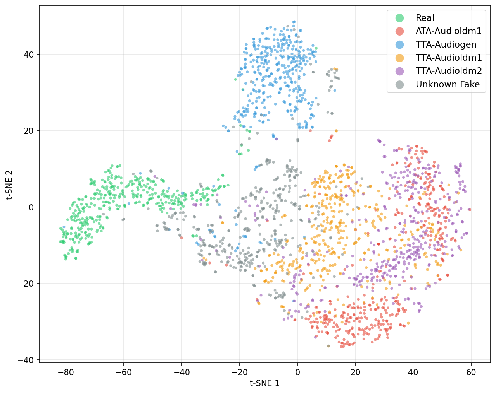

# Audio Deepfake Detection — BEATs + Log-Likelihood Fake-Only Scoring

Detecting AI-generated (deepfake) environmental audio for the **ESDD challenge (ICASSP)**.

The headline method, **LL_fake_only**, throws away the classification head at inference time.
Instead it fits a Gaussian on the embeddings of *fake training audio* and scores a clip by how
**far from fake** it is:

```
score(x) = -log p(x | N(mu_fake, Sigma_fake))     # high score = real, low score = fake
```

This generalises across domains far better than scoring against a *real* reference: every generator
lands somewhere inside a shared fake region of the embedding space, and real audio sits outside it.
The Gaussian covers that whole region, so "distance from fake" never depends on which real-audio
domain the test set happens to come from.

<p align="center">
  
</p>

*t-SNE of the embeddings on the EnvSDD test subset (TUTASC19 split, BEATs fine-tune + multi-head).
Real audio holds its own region on the left, each seen generator forms a distinct cluster, and
generators never seen in training — ATA-Audioldm2, TTA-Audiolcm, TTA-Tangoflux, in grey — settle
among the fake clusters rather than joining the real one. That is the property the scoring function
relies on: you do not need to recognise which generator produced a clip, only that it is far from
real and close to fake. Regenerate with `scripts/tsne_khoi.py`.*

---

## Quickstart — score a .wav file

Everything needed for inference is packaged in [`LL_fake_only/`](LL_fake_only/), including the
pre-computed fake distribution (`reference_stats.npz`), so you never re-run the training set:

```bash
pip install -r LL_fake_only/requirements.txt
python LL_fake_only/detect.py LL_fake_only/samples/sample_fake.wav
```

```
File                                     Prediction  Confidence      Score
---------------------------------------------------------------------------
sample_fake.wav                               FAKE✗      78.0%     1707.6
sample_real.wav                               REAL✓      99.2%     6216.1
```

Any sample rate, any length, mono or stereo — audio is resampled to 16 kHz and split into 4 s
windows automatically. Model load costs ~20 s once; each file after that scores in well under a
second.

Full usage (training, full-test-set evaluation, rebuilding the reference) is documented in
**[`LL_fake_only/README.md`](LL_fake_only/README.md)**.

---

## Results

`-LL(fake)` scoring with the 2-stage BEATs checkpoint:

| Test set | Real / Fake | AUC | Accuracy | F1 macro |
|----------|-------------|-----|----------|----------|
| test_track2 (challenge) | 1,994 / 7,980 | 0.9288 | 85.52% | 0.8035 |
| Event_test | 1,801 / 12,607 | 0.9443 | 88.13% | 0.7893 |
| TUTASC19_test | 1,801 / 12,607 | 0.9907 | 95.43% | 0.9079 |

EER on test_track2 is 14.49% at threshold 2650.56 — that threshold, plus a logistic confidence
calibration, is baked into `reference_stats.npz`.

---

## Method in brief

**Backbone.** BEATs (pretrained audio encoder) with three heads; all scoring uses the 527-dim
`bonafide_head` output.

**Training.** Two stages, balanced batches (6 clips per fake generator + 24 real = 48):

| | Epochs | LR | `ce_w` | `ce_real_w` | `ccl_real_w` |
|---|---|---|---|---|---|
| Stage 1 — feature learning | 15 | 3e-7 | 3.0 | 2.5 | 4.0 |
| Stage 2 — refinement | 8 | 1.5e-7 | 3.0 | 4.0 | 4.0 |

```
L = 0.2 * ArcFace + 0.8 * CCL + ce_w * CE
```

* **ArcFace** — 5-class angular margin, separates individual generators
* **CCL** — binary real/fake center contrastive loss
* **CE** — multi-class on the softmax head, upweighted toward real

**Inference.** Fit `N(mu_fake, Sigma_fake)` on fake training embeddings once, then score by
negative log-likelihood (Mahalanobis distance via Cholesky). Decision at the EER threshold;
confidence = `sigmoid((score - threshold) / scale)`.

Detailed write-up: **[`docs/method.md`](docs/method.md)**.

**Classes.** `real`, `fake_ata_01` (ATA-Audioldm1), `fake_tta_01` (TTA-Audiogen),
`fake_tta_02` (TTA-Audioldm1), `fake_tta_03` (TTA-Audioldm2).

---

## Repository layout

```
LL_fake_only/        Self-contained detection package (the deliverable)
  detect.py          ★ Score a .wav → REAL/FAKE + confidence
  infer.py           Full evaluation over a test set (metrics, ROC, per-file CSV)
  train.py           2-stage training
  precompute_reference.py   Rebuild reference_stats.npz after retraining
  reference_stats.npz       Pre-computed fake Gaussian + threshold + calibration
  data/              Train/test JSON manifests
  samples/           One real and one fake example clip
  src/               Bundled copy of the model code it needs
src/                 Research code: BEATs backbone, datasets, Lightning modules, inference
  base_dataset.py    BeatsDataset + BalancedGeneratorSampler
  base_ptln.py       Lightning module (ArcFace + CCL + CE)
  beats/             BEATs backbone and heads
  inference/         Scoring variants (CCL, distribution, likelihood-ratio, ensemble, ...)
scripts/             Training shell scripts, evaluation sweeps, plotting
notebooks/           Data preparation and exploration
docs/                Method write-up and figures
```

---

## What is *not* in this repository

Model weights and audio data are excluded (GitHub caps files at 100 MB):

| File | Size | Needed for |
|------|------|-----------|
| `LL_fake_only/checkpoint/ll_fake_only_stage2.ckpt` | 1.1 GB | inference & evaluation |
| `src/beats/BEATs_iter3_plus_AS2M_finetuned_on_AS2M_cpt2.pt` | 347 MB | any BEATs model |
| `LL_fake_only/src/beats/…_cpt2.pt` | 347 MB | the standalone package |
| `data/` audio (ESDD / Event / TUTASC19 / test_track2) | — | training & evaluation |

The BEATs pretrained weights come from the
[official BEATs release](https://github.com/microsoft/unilm/tree/master/beats)
(`BEATs_iter3+ (AS2M) (cpt2)`). The trained checkpoint is shared separately — drop it at the path
above and `detect.py` works immediately. The JSON manifests reference audio by relative path
(`data/test/...`), so point them at your own copy of the datasets.

---

## Environment

Python 3.11, PyTorch with CUDA (tested on `torch 2.9.1+cu126`); CPU also works, just slower.

```bash
conda create -n ll_fake_only python=3.11 -y
conda activate ll_fake_only
pip install -r LL_fake_only/requirements.txt
```

On WSL use `num_workers=0` — the default in every script here.
